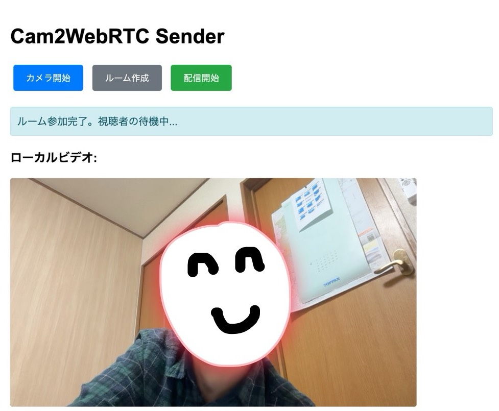
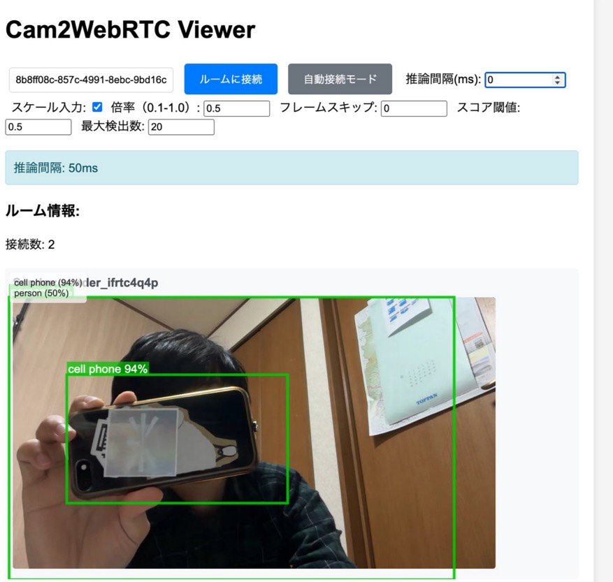
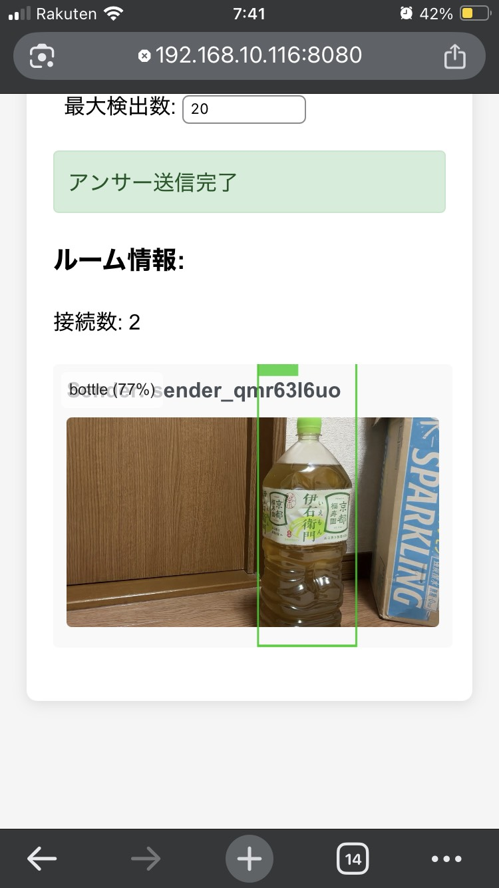

# ws2infer-js
</img>
</img>
</img>

## コンセプト
AI推論をエッジコンピューティングすることです。\
`cargo run` でお試しください。\
https://localhost:8080 でウェブが見れます。\
推論結果は`signaling server側`の`SQLite/jsonl`で保存され、AI学習・推論データとして活用できます。

リアルタイム WebRTC ビデオストリーミング + TensorFlow.js 推論プラットフォーム

カメラ配信者と複数のビューアーが P2P Mesh 接続でビデオを共有し、ビューアー側でリアルタイム物体検出（COCO-SSD）を実行。推論結果はサーバーで集約・管理されます。

## 主な機能

### サーバー側（Rust）
- **WebSocket シグナリング**: 1 送信者 + N 受信者の Mesh P2P セットアップ
- **内蔵 STUN/TURN サーバー**: NAT 越え対応（UDP:3478, 3479）
- **推論結果の永続化**: SQLite + JSONL で自動保存（編集・AI連携向け）
- **推論結果管理**: ビューアーから送られた検出結果をルーム別に保存・集約・ブロードキャスト
- **REST API**: ルーム作成・確認、サーバーコンフィグ取得

### ビューアー側（JavaScript + TensorFlow.js）
- **リアルタイム物体検出**: COCO-SSD モデル（80 クラス対応）
- **キャンバス描画**: バウンディングボックス＆ラベル表示
- **推論パフォーマンス カスタマイズ UI**:
  - 推論間隔（50ms～）
  - 入力スケール（0.1～1.0 で高速化）
  - フレームスキップ（推論頻度削減）
  - スコア閾値（信頼度フィルター）
  - 最大検出数（検出数制限）
- **自動レイアウト**: 複数ビューアーの動画をグリッド表示

## セットアップ

### 要件
- Rust

### インストール & 実行

```bash
# リポジトリをクローン
git clone https://github.com/your-repo/ws2infer-js.git
cd ws2infer-js

# Rust サーバーをビルド
cargo build --release

# サーバーを起動（TLS 自動生成）
cargo run --release
# または
./target/release/cam2webrtc
```

サーバーはデフォルト `https://0.0.0.0:8080` で起動します。

### ブラウザでアクセス

- **送信者**: https://localhost:8080/sender.html or https://YOUR_IP:8080/sender.html
- **受信者**: https://localhost:8080/viewer.html or https://YOUR_IP:8080/viewer.html

ローカルテスト:
```bash
https://localhost:8080/sender.html
https://localhost:8080/viewer.html
```

## 使い方

### 1. ルーム作成・接続

**送信者側 (sender.html)**:
1. ルーム ID を入力 → 「ルーム作成」
2. カメラへのアクセスを許可
3. 配信開始

**受信者側 (viewer.html)**:
1. 送信者と同じルーム ID を入力 → 「ルームに接続」
2. ビデオ配信が開始され、自動的に物体検出が始まります

### 2. 推論パフォーマンス のカスタマイズ

ビューアーページのコントロールパネルで以下を調整可能:

| パラメータ | 範囲 | デフォルト | 説明 |
|-----------|------|-----------|------|
| 推論間隔(ms) | 50～ | 1000 | ループの実行間隔（小さいほど高速） |
| スケール入力 | ON/OFF | ON | 入力画像をリサイズして推論（CPU軽減） |
| 倍率 | 0.1～1.0 | 0.5 | スケール入力の縮小率 |
| フレームスキップ | 0～10 | 0 | N フレームごとに推論（0=毎フレーム） |
| スコア閾値 | 0～1 | 0.5 | この値以上の検出のみ表示・送信 |
| 最大検出数 | 1～100 | 20 | 1フレーム内の最大検出数 |

**推奨設定（最速）**:
```
推論間隔: 100ms
フレームスキップ: 1
スケール入力: 有効
倍率: 0.3
スコア閾値: 0.5
最大検出数: 10
```

## API エンドポイント

### REST API

**ルーム作成**
```
POST /api/rooms
Content-Type: application/json
{}
```
応答:
```json
{
  "room_id": "uuid-here"
}
```

**ルーム確認**
```
GET /api/rooms/{room_id}
```
応答:
```json
{
  "exists": true
}
```

**サーバーコンフィグ取得**
```
GET /api/config
```
応答:
```json
{
  "ice_servers": [{"urls": ["stun:YOUR_IP:3478"]}],
  "tls_enabled": true,
  ...
}
```

## 推論結果の永続化

推論結果は自動的に下記の 2 形式で保存されます:

- **SQLite** (`data/inference.db`): 永続的なデータベース。検索・集約・バックアップが容易
- **JSONL** (`data/inference.jsonl`): 行区切り JSON 形式。人や他の AI が編集・流し込み可能

### 確認コマンド

```bash
# JSONL で確認（リアルタイム、行単位で読み書き可能）
cat data/inference.jsonl | jq .

# SQLite で検索
sqlite3 data/inference.db 'SELECT room_id, source_id, ts, substr(payload,1,200) FROM inference ORDER BY id DESC LIMIT 10;'
```

## 設定ファイル（config.json）

```json
{
  "signaling_addr": "0.0.0.0:8080",
  "stun_addr": "0.0.0.0:3478",
  "turn_addr": "0.0.0.0:3479",
  "ice_servers": [
    {"urls": ["stun:localhost:3478"]}
  ],
  "video_constraints": {
    "width": {"ideal": 1280},
    "height": {"ideal": 720}
  },
  "tls_enabled": true,
  "tls_cert_path": "cert.pem",
  "tls_key_path": "key.pem"
}
```

## トラブルシューティング

### ビデオが表示されない
- ブラウザのコンソール（F12）で JavaScript エラーを確認
- ファイアウォールで UDP 3478/3479 を許可
- STUN/TURN サーバーが起動しているか確認: `cargo run --release`

### 推論が遅い
- 「フレームスキップ」を増やす
- 「スケール入力」を有効にして倍率を下げる（0.2～0.3）
- 「スコア閾値」を上げて低信頼度の検出を削除

### 複数ビューアーでの CPU 高負荷
- 推論間隔を長くする（例: 500ms）
- 複数ビューアーで異なる倍率を設定

## パフォーマンス最適化

### クライアント側（JavaScript）
- **GPU 加速**: TensorFlow.js は WebGL/WebGPU を自動選択
- **オフスクリーン Canvas**: 入力画像をスケールしてから推論（速度 2～5倍）
- **フレームスキップ**: 推論頻度を削減して CPU/GPU 使用率低減

### サーバー側（Rust）
- **軽量集約**: ルーム内の最新推論結果のみ保持
- **非ブロッキング**: Tokio 非同期実行で複数接続並行処理

## ライセンス

MIT License

## 参考・使用ライブラリ

- **Rust**: `warp`, `tokio`, `serde_json`, `webrtc-rs`
- **JavaScript**: `TensorFlow.js`, `COCO-SSD model`
- **WebRTC**: 標準 Web API
