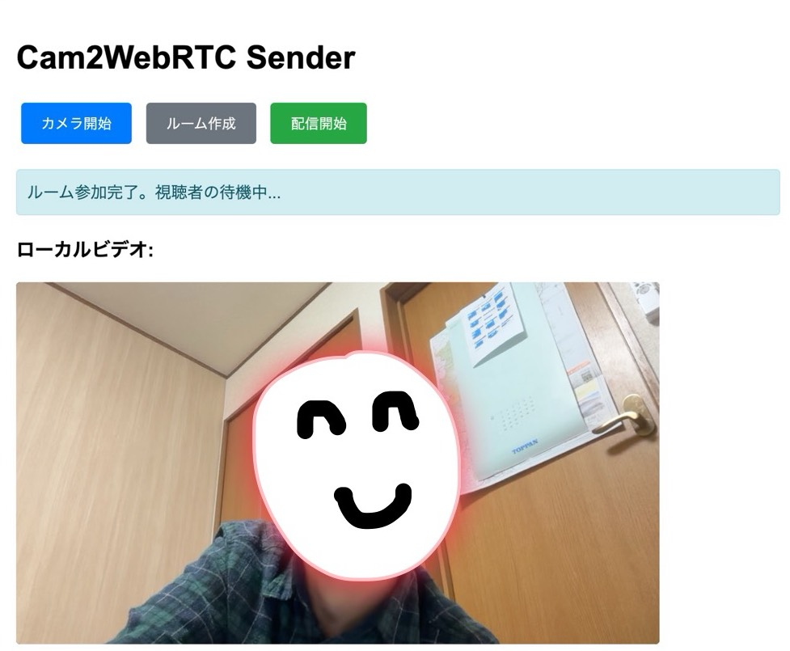
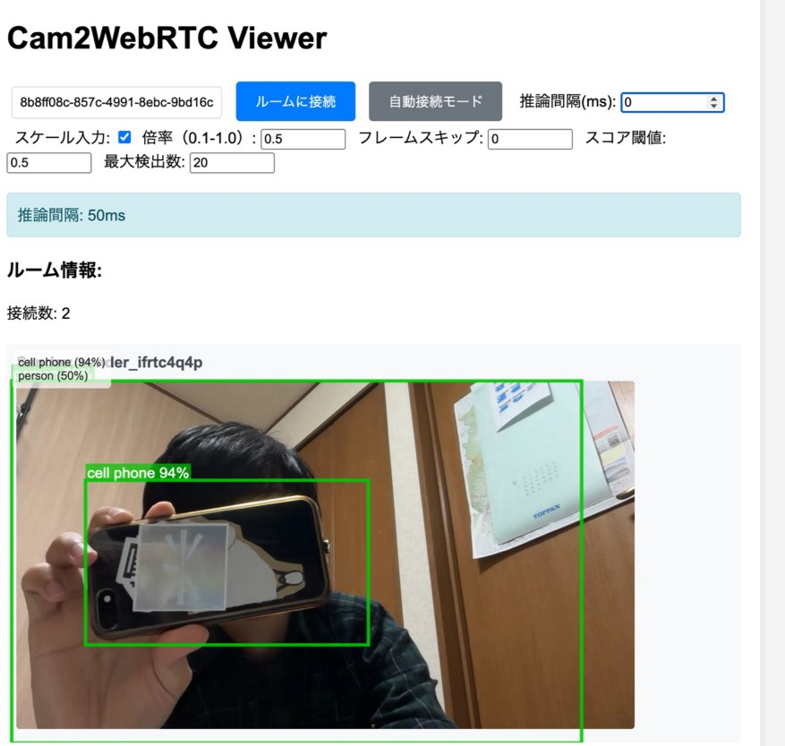
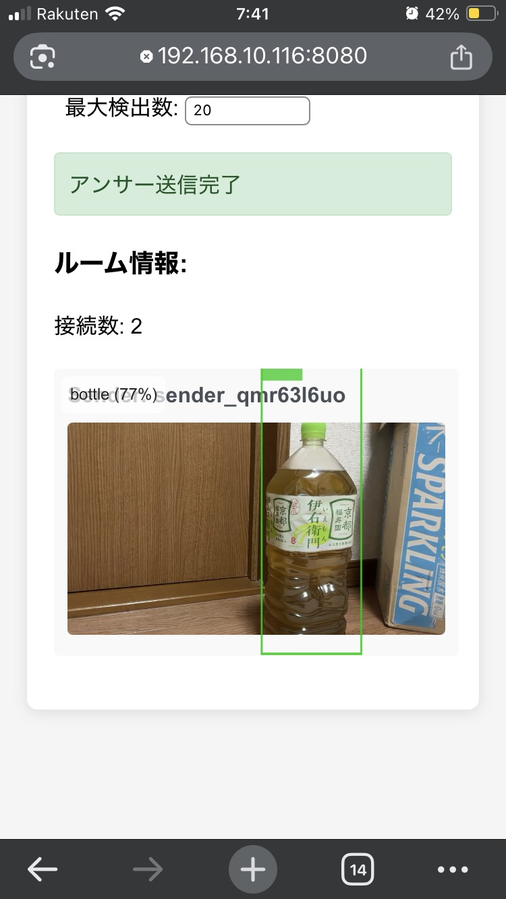

# cam2webrtc (ws2infer-js)

WebRTC を用いたリアルタイム映像配信と、WebGPU による高速なクライアントサイド推論（物体検出・日本語OCR）を行うシグナリングサーバーです。  
`DEV_POLICY.md` に基づき、**「変更耐性」** と **「GPU First 加速」** を両立する設計で構成されています。

<div align="center">
  </img>
  </img>
  </img>
</div>

## 📐 アーキテクチャ

```
Sender (カメラ)  ──WebRTC──▶  Viewer (推論 + 表示)
         ▲                         │
         └── Signaling (WS) ◀──────┘
                  │
          Rust (Warp + STUN/TURN)
```

| レイヤー | 技術 |
|---------|------|
| サーバー | Rust (Warp / Tokio) — WebSocket, HTTPS (自己署名証 自動生成), STUN, TURN |
| フロント | Vanilla JS — **ONNX Runtime WebGPU** / OpenCV-WASM |
| OCR エンジン | **PP-OCRv4** (DB + CRNN) / DEIM + PARSeq — 高速日本語認識 |
| 映像 | WebRTC 1:N P2P Mesh |

## 🚀 実行方法

### 前提条件
- Rust (stable)
- Node.js / npm (Worker ビルド用)

### サーバー起動 (自動ビルド)
```bash
cargo run
```
`build.rs` により、初回実行時に以下が自動で行われます：
1. **Worker ビルド** — `ndlocr-lite-wasm-src/` をビルドし `static/ndlocr/` へ展開。
2. **モデル・資産配備** — **PP-OCRv4** モデル、**OpenCV-WASM** 実体などを自動配備。
3. **サーバー起動** — `https://localhost:8080` で待ち受け開始。

### 配信・視聴
| ページ | URL |
|--------|-----|
| 配信 (Sender) | `https://localhost:8080/sender.html` |
| 視聴 (Viewer) | `https://localhost:8080/viewer.html` |

## ⚙️ 推論プリセット (Viewer)

Viewer 側で WebGPU による加速モードを選択できます：

| プリセット | モデル構成 | 特徴 |
|-----------|----------|------|
| **PP-OCRv4** | DBDetector + CRNN | **爆速・軽量**。WebGPU に最適化された最新 CNN モデル。 |
| **標準 (Standard)** | DEIM-S + PARSeq | 高精度。Transformer ベースの重厚な認識。 |
| **軽量 (Lite)** | DEIM-S (INT8) + PARSeq | 低速回線向け。検出モデルを軽量化。 |
| **COCO-SSD** | MobileNetV2 | 一般物体検出 (TF.js)。 |

## 🧪 テスト

```bash
cargo test
```
シグナリングフロー、ルーム管理、および Worker ビルド資産の完全性を検証します。

## 📜 サードパーティライセンス

本プロジェクトは、以下の優れたオープンソースプロジェクトおよび学習済みモデルを利用しています。各著作権者に深く感謝いたします。

### 1. 推論エンジン・ライブラリ
| プロジェクト | ライセンス | 用途 |
|-------------|-----------|------|
| [ONNX Runtime Web](https://github.com/microsoft/onnxruntime) | **MIT** | WebGPU/WASM 推論ランタイム |
| [OpenCV](https://opencv.org/) | **Apache 2.0** | 画像処理・輪郭抽出 (DBDetector) |
| [TensorFlow.js](https://www.tensorflow.org/js) | **Apache 2.0** | 物体検出 (COCO-SSD) |

### 2. OCR モデル・アーキテクチャ
| プロジェクト / モデル | ライセンス | 詳細 |
|----------------------|-----------|------|
| [PaddleOCR (PP-OCRv4)](https://github.com/PaddlePaddle/PaddleOCR) | **Apache 2.0** | 高速な文字検出・認識モデル |
| [ndlocr-lite-wasm](https://github.com/tamoco-mocomoco/ndlocr-lite-wasm) | **CC BY 4.0** | 日本語 OCR 統合のベース実装 |
| [DEIM](https://github.com/Y-T-G/DEIM) | **Apache 2.0** | Transformer ベースのリアルタイム物体・テキスト検出 |
| [PARSeq](https://github.com/baudm/parseq) | **Apache 2.0** | シーンテキスト認識モデル |

### 3. ndlocr-lite-wasm の改変利用について
`ndlocr-lite-wasm-src/` 以下のコードは、[tamori naoto](https://github.com/tamoco-mocomoco/ndlocr-lite-wasm) 氏による実装をベースに、本プロジェクト（ws2infer-js）向けに以下の高度な改変を行っています（ライセンス：CC BY 4.0）。

- **WebGPU 加速の統合**: JSEP を活用した WebGPU 推論プロバイダへの完全対応。
- **PP-OCRv4 エンジンの追加**: `DBDetector` および `CRNNRecognizer` の新規実装。
- **OpenCV-WASM 連携**: 検出後のポストプロセス（輪郭抽出・Unclip）の高速化。
- **DI コンテナの導入**: エンジンの動的な差し替えとテスト容易性の確保。

---
*詳細な開発方針については `DEV_POLICY.md` を参照してください。*
